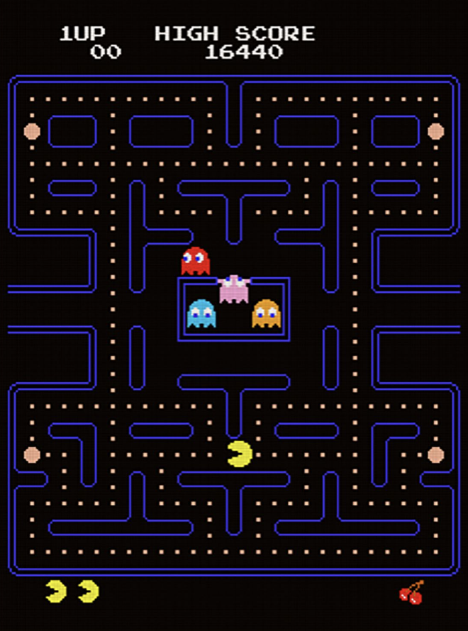
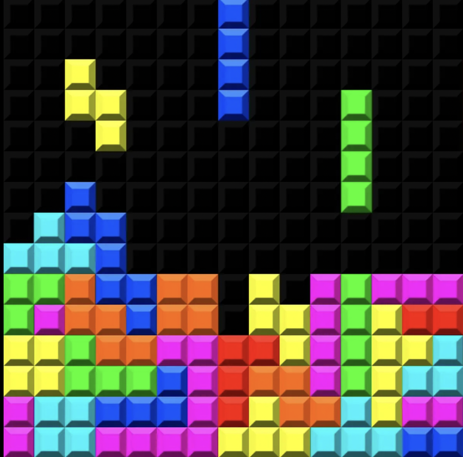
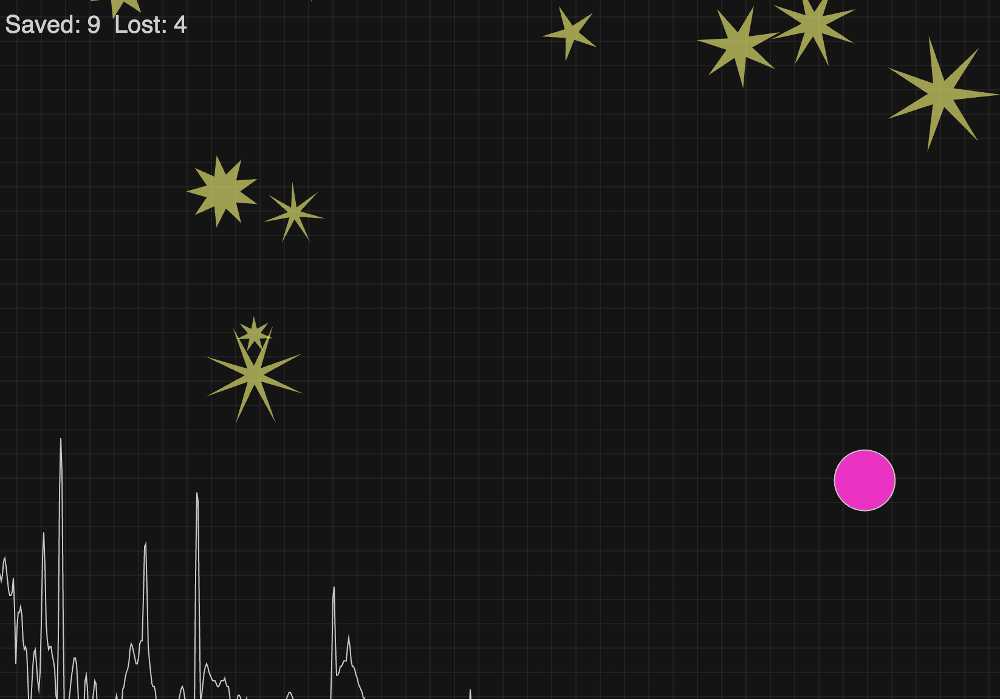
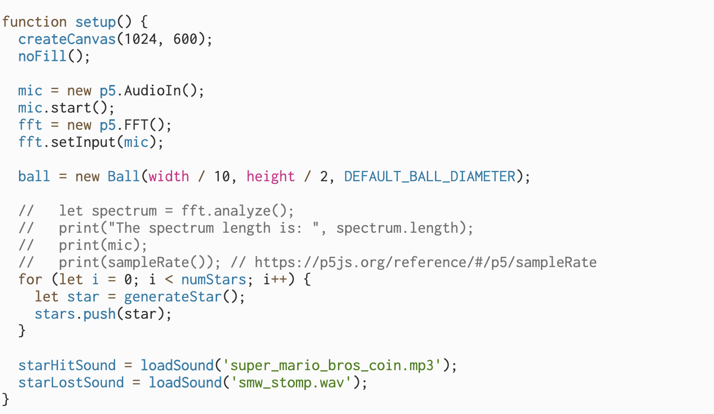
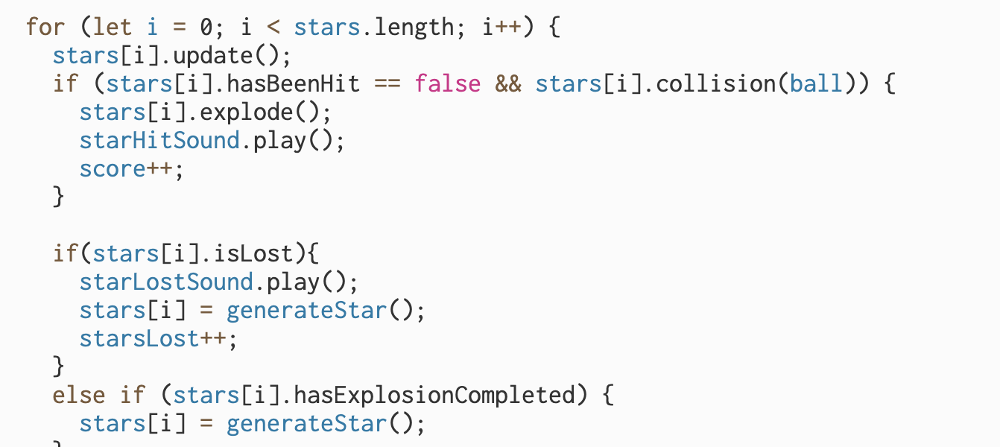

zdzi0994

Week 8 Quizz

<h1>Part 1: Imaging Technique Inspiration</h1>

<h2>Audio Reactive to Visuals<h/2>

<h3>For my teams group project we are using Piet Mondrian 'Broadway Boogie Woogie' which we think we could transform into a basic retro-looking game, our initital inspiration was Pac-Man. I think an interesting element of pacman is the way sound is used to highlight different interactions with the (limited) space. Each new interaction the character has, is paired with a sound effect both enhancing the expeirence and is a form of communication with the user. This could be an interesting way to think about the sound component we need to incorporate in our major project: input sound effects for various interactions/manipulations that happen with the objects in our gameplay.<h3>

**Exmaples:**

Example 1
Pac Man Arcade Game

<h5>(CNN, 2020)</h5>

Example 2

<h5>(Guardian, 2024)</h5>

<h1>Part 2: Coding Technique Exploration</h1>

<h2>p5.SoundFile + FFT()<h/2>

<h3>To create sound effects based on user interaction we would need to employ the p5.SoundFile functions, first using soundUpload() to upload our sounds to the library. To deploy, it is important to consider soundFormats() for compatibility across different web browsers. The idea here would be to attach play() and pause() functions to user and/or object interactions through if/else statements. Furthermore, using sound we can enhance the user's experience by creating a dynamic game interface through analysing and using volume and amplitude. We can analyze these variables using FFT() giving us parameters to work with. Another approach would be to allow users to use their microphone (audioIn()) and control the game using their voice.<h3>

**Exmaples:**

Exmaple of p5js sound interactive game by Jon Froehlich: 

Link to game and code: 

