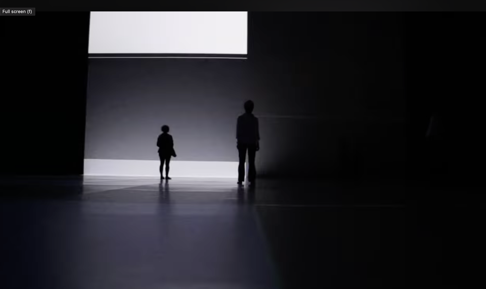
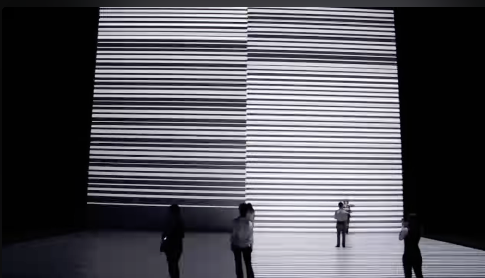

# zdzi0994_10

Week 8 Assignment 

Part 1: Imaging Technique Inspiration  

Audio Reactive to Visuals

For my teams group project we are using Piet Mondrian 'Broadway Boogie Woogie' which we think we could transform into a basic retro-looking game, our initital inspiration was Pac-Man. I think an interesting element of pacman is the way sound is used to highlight different interactions with the (limited) space. Each new interaction the character has, is paired with a sound effect both enhancing the expeirence as a communication with the user. This could be an interesting way to think about the sound component we need to incorporate in our major project: input sound effects for various interactions/manipulations that happen with the objects in our gameplay. 

**Exmaples:**

Example 1
Pac Man Arcade Game

##(CNN, 2020)

Example 2

##(Guardian, 2024)

Part 2: Coding Technique Exploration

Audio reactive visuals use p5.js to create visuals which are generated/manipulated through sound. p5.js can read sound through amplitude or frequency which can be inputted through a microphone or by uploading a track into p5 and analysing the frequency using fft methods. Learning how to use the fft method can be useful for the major project as it can help us manipulate our groups chosen painting through reaction to different sounds. As we are considering mimicking an arcade game for our final project, it could be interesting to use arcade sounds to affect the representation of the painting 

